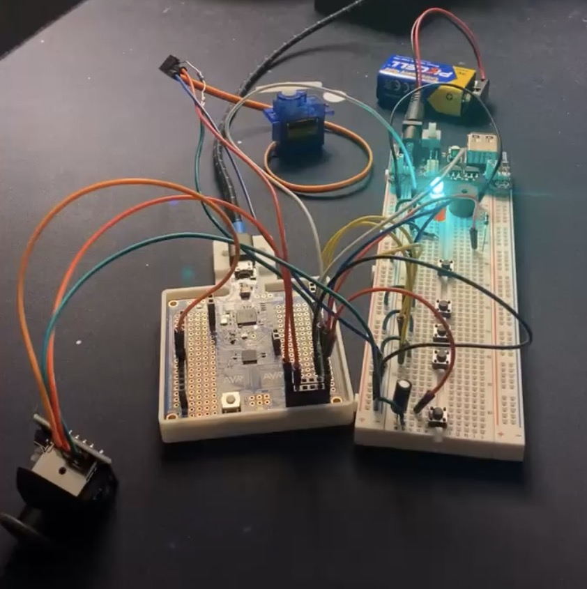
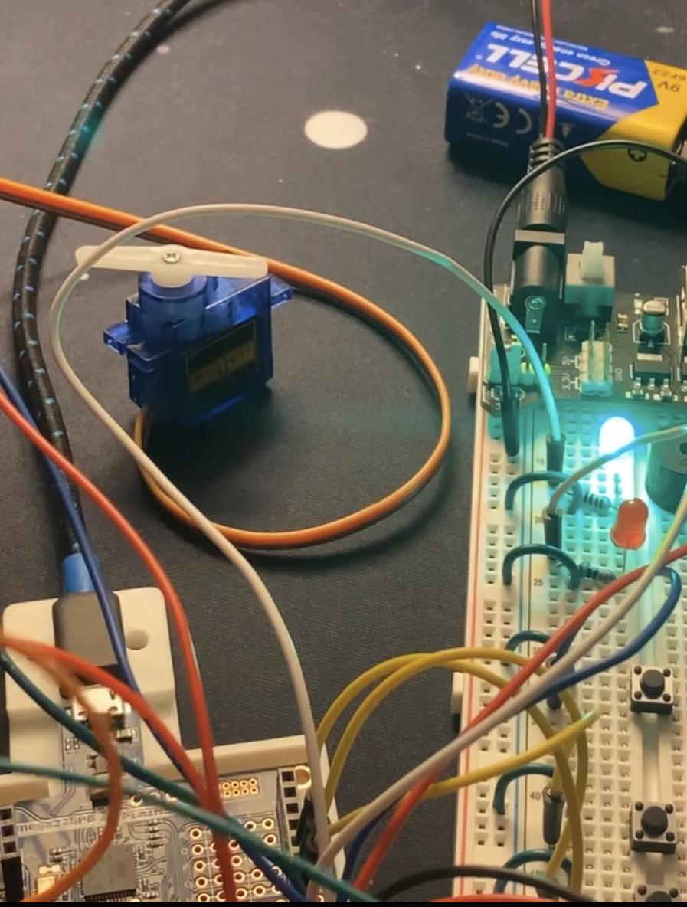
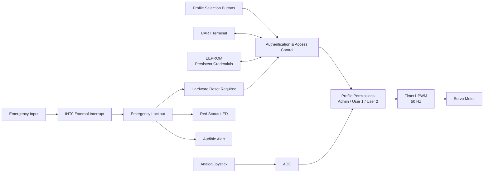
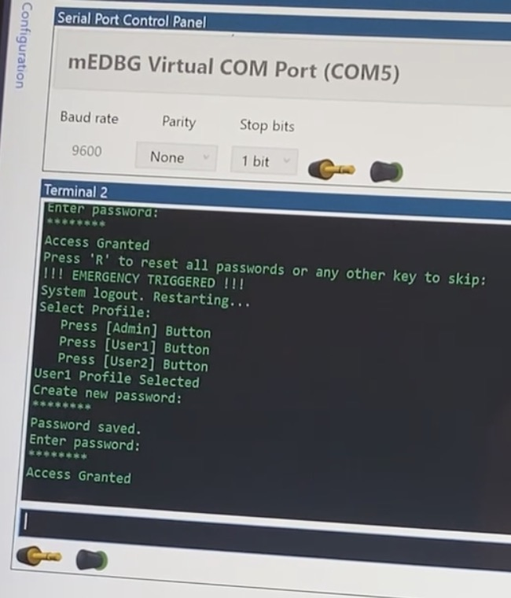

# Profile-Based Embedded Robotics Controller

An embedded access-control and robotics system developed using an ATmega328PB microcontroller, AVR C, and AVR assembly.

The controller combines persistent user authentication with profile-based hardware permissions. Users authenticate through a UART terminal before gaining access to joystick-controlled servo movement, while each profile is assigned a different allowable range of motion. The system also incorporates an interrupt-driven emergency lockout, visual status indication, audible feedback, and administrative credential management.



## Project Overview

This project was independently designed and developed as a Microprocessors II project to integrate multiple embedded-system concepts into a single working application.

Rather than allowing every user identical control of the hardware, the system uses three selectable profiles:

- **Admin**
- **User 1**
- **User 2**

Each profile has its own password stored in EEPROM and its own permitted servo-control range.

After successful authentication, the microcontroller enables the system's control functions. Joystick input is sampled through the ADC and converted into a PWM command for the servo motor. The resulting command is then limited according to the currently authenticated user's permissions.

## Key Features

- Three independent user profiles
- Persistent password storage using EEPROM
- Password creation for uninitialized profiles
- Masked password entry through UART
- Three-attempt authentication lockout
- Administrative password-reset functionality
- Profile-based servo movement permissions
- Analog joystick input using the ADC
- 50 Hz servo PWM generated with Timer1
- Interrupt-driven ADC sampling
- External-interrupt emergency input
- Hardware reset and reauthentication following emergency lockout
- Red and green status indication
- Audible buzzer feedback
- Low-level peripheral configuration in AVR C
- Custom timing routine implemented in AVR assembly

## Profile-Based Control

The authenticated profile determines how much of the servo's available range the user is permitted to command.



| Profile | Authentication | Approximate Servo Access |
| --- | --- | --- |
| Admin | Required | Full range (~180°) |
| User 1 | Required | Limited range (~90°) |
| User 2 | Required | Limited range (~45°) |

The ADC continuously reads the joystick position and generates a corresponding servo command. The firmware then clamps that command to the minimum and maximum values allowed for the selected profile.

This allows authentication to control not only whether the system can be used, but also **what the authenticated user is authorized to do**.

## System Operation

### System Architecture



### Control Sequence

```text
Power On
   |
   v
Select User Profile
   |
   v
Check EEPROM for Existing Password
   |
   +---- No ----> Create and Store Password
   |
   v
Authenticate User
   |
   +---- Failure ----> Retry ----> Lockout After 3 Attempts
   |
   v
Access Granted
   |
   v
Enable ADC + PWM + Emergency Interrupt
   |
   v
Joystick Controls Servo
   |
   v
Apply Profile-Specific Motion Limits
   |
   v
Emergency Input Triggered?
   |
   +---- Yes ----> Revoke Access
                   Stop Interrupt-Driven Control Updates
                   Activate Alert
                   Require Hardware Reset
                   Return to Authentication
```

## Embedded Systems Implementation

### UART Communication

UART provides the primary user interface for:

- Password creation
- Password entry
- Authentication feedback
- Administrative commands
- Emergency-status messages

The interface operates at **9600 baud** with 8-bit data, one stop bit, and no parity.

### EEPROM

Internal EEPROM provides nonvolatile storage for each profile's password.

The firmware includes custom routines for:

- Reading EEPROM data
- Writing EEPROM data
- Verifying EEPROM writes
- Detecting uninitialized credentials
- Resetting stored passwords

The EEPROM update routine avoids unnecessary writes when the stored value already matches the new data, reducing unnecessary EEPROM wear.

Because credentials are stored in nonvolatile memory, user profiles persist after power is removed.

### Analog-to-Digital Conversion

An analog joystick is connected to the microcontroller's ADC.

ADC conversions are handled through an interrupt service routine, allowing joystick position to continuously update the requested servo position during normal operation.

### PWM Servo Control

Timer1 is configured for **50 Hz Fast PWM**, providing the timing required for servo control.

The ADC reading is mapped to a PWM pulse width and then constrained according to the permissions associated with the authenticated profile.

### Interrupts

The project uses hardware interrupts for two primary functions:

- ADC conversion completion
- Emergency-input detection

The external emergency input uses INT0 and sets a system flag that initiates the emergency lockout procedure.

## Emergency Lockout

An external emergency input can interrupt normal operation while the controller is active.



When triggered, the system:

1. Revokes the current user's access
2. Stops interrupt-driven control updates
3. Switches the status indication to red
4. Provides audible feedback
5. Reports the emergency condition through UART
6. Waits for a hardware reset input
7. Returns the system to the authentication process

This prevents the previous session from automatically regaining control after the emergency condition is cleared.

## Hardware

The prototype integrates:

- ATmega328PB microcontroller
- Analog joystick
- Servo motor
- Profile-selection pushbuttons
- Emergency input
- Reset pushbutton
- Red and green status LEDs
- Buzzer
- UART serial interface
- Supporting breadboard circuitry

## Software

The firmware was developed primarily in **AVR C**, with a supporting timing routine written in **AVR assembly**.

Major microcontroller resources used include:

- GPIO
- UART
- EEPROM
- ADC
- Timer1
- PWM
- External interrupts
- ADC interrupts

Peripheral registers are configured directly rather than through high-level hardware abstraction libraries.

## Repository Structure

```text
microcontroller-profile-security-system/
|
├── README.md
├── .gitignore
|
├── firmware/
|   ├── main.c
|   └── myDelay_ms.S
|
└── images/
    ├── system-overview.jpg
    ├── servo-control.jpg
    └── emergency-lockout.jpg
```

## Engineering Concepts Demonstrated

This project provided practical experience with:

- Embedded C programming
- AVR assembly
- Register-level microcontroller programming
- Persistent nonvolatile memory
- User authentication
- Profile-based access control
- Analog signal acquisition
- PWM generation
- Interrupt-driven programming
- Hardware/software integration
- Embedded control-system design
- System testing and troubleshooting

## Design Approach

A major goal of the project was to connect software permissions to physical hardware behavior.

Authentication is therefore not used only as a login mechanism. The authenticated profile directly affects the physical range of control available to the user.

This creates a simple profile-based authorization model within an embedded control system:

**Identity → Authentication → Authorization → Physical Control**

## Future Improvements

Potential extensions to the project include:

- Hashed or otherwise protected credential storage
- Expanded user-profile management
- Configurable permissions stored in EEPROM
- Additional servo axes or robotic actuators
- LCD or local menu interface
- Improved switch debouncing
- Watchdog-based fault recovery
- Event logging
- PCB implementation
- Enclosure design
- Expanded safety circuitry

## Demonstration

A full demonstration of the Profile-Based Embedded Robotics Controller is available below.

[▶ View the system demonstration](demo/profile-based-controller-demo.mp4)

The demonstration includes:

- User profile selection
- UART-based password authentication
- Profile-specific servo movement limits
- Joystick-based servo control
- Emergency lockout behavior
- Hardware reset and reauthentication

## Author

**Aidan Dudash**

Electrical Engineering Technology / Computer Science  
Embedded Systems • Automation • Controls • Robotics
